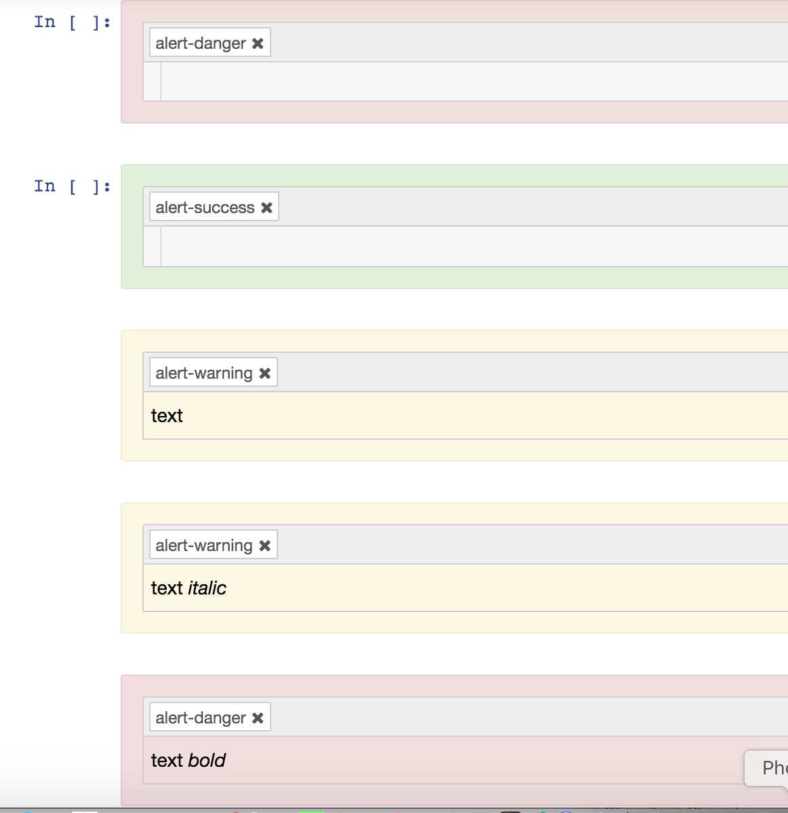

# nb\_extension\_tagstyler
Style Jupyter notebook cells by tag.

[](https://mybinder.org/v2/gh/innovationOUtside/nb_extension_tagstyler/master)


Content in Jupyter notebook markdown cells can be styled by adding a range of `alert` class attributes to `div`s contained within the cell.

Wouldn't it be easier if we could just tag the cell?

Currently, only `alert-success` (green), `alert-warning` (yellow), `alert-danger` (pink) and `alert-info` (blue) tags are supported. You also need to manually reload the notebook in the browser to render the styling. *(TO DO: try to mod the tag entry thing so it reflows the cell styling if a cell tag is added?)*



The extension also increases the notebook load time as it iterates through every cell looking for tags.

Install via:

`pip install git+https://github.com/innovationOUtside/nb_extension_tagstyler.git`

`pip install nb_extension_tagstyler`

The extension should be automatically installed and enabled.

If you need to do things manually:

```
jupyter nbextension uninstall tagstyler
jupyter nbextension install tagstyler --user
jupyter nbextension enable tagstyler/index
```
